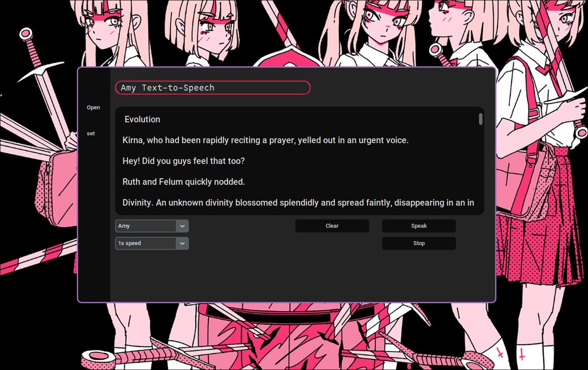

## Amy Text-to-speech

<h1 align="center">
  
   
  Amy Text-to-speech
   
  
</h1>

  
  
   
   
  

## 📖 About

Amy TTS is a text-to-speech engine that runs using minimal CPU power but doesnt sacrifice on quality
Amy can easily run on a raspberry Pi and the steam deck with faster than real time speech generation.

Amy text-to-speech engine that can be used as a Speech-Dispatcher module, as a command line tool to turn text into speech, or as a simple GUI interface to write and listen to text.
Its great for using with bash scripts, accessibility, listening to articles or turning text into an audiobook.

### 🎨 Features

- a voice that is smooth and comfortable to listen to
- faster than real time speech generation
- a simple and easy to use GUI
- an extensive Command line application

## Installation

1. Navigate to this Github page on a browser of your choice.
1. Download the [installer file](https://github.com/sweetbbak/moe-amy-tts/releases/download/v1.0/Amy_TTS-x86_64.AppImage).
1. Drag the file onto your desktop and double click it, check "Make Executable" to run it.

## 📜 Credits

Piper-TTS
Decky-Loader
